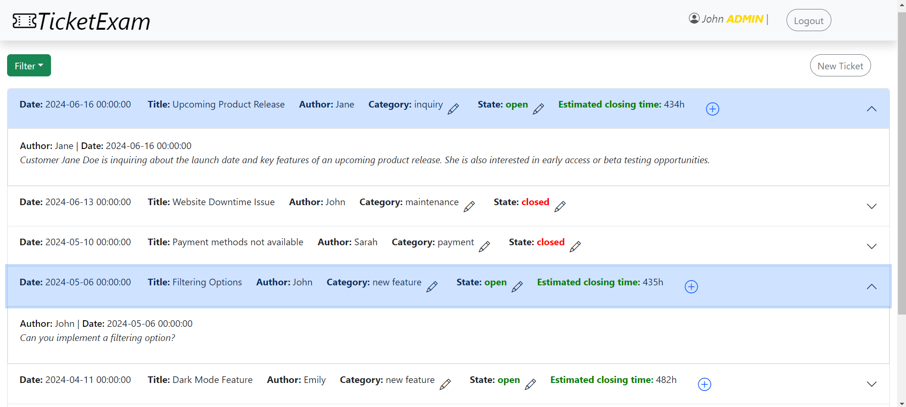

"Ticketing System"
## BLOISE GIOVANNI 

Ticketing system's app developed by using React,Express,SQLite3 and PassportJS (Bootstrap as well)

## React Client Application Routes

- Route `/`: It's the main page of the app: it shows the list of the tickets and also the blocks if the user is logged in.
- Route `/addB`: Allows logged in user to add a new block, then the user is redirected to the main route
- Route `/addT`: Allows logged in user to add a new ticket. It's a read-only page.
- Route `/login`: Login form, allows users to login. If everything is fine, the user is redirected to the main route.
- Route `*`: Page for nonexisting URLs (Not Found page) that redirects to the home page.

## API Server

* **GET `/api/tickets`**: Get all the tickets as a JSON list.
  - **Response body**: JSON object with the list of tickets, or description of the error(s):
    ```
    [ { "state": "open", "code": 1, "category": "payment",
    "owner": 1, "timestamp": "2024-06-16","title":"Upcoming Product Release" ,"author": "Jane" }, ... ]
    ```
  - Codes: `200 OK`, `500 Internal Server Error`.
* **GET `/api/blocks`**: Get all the blocks as a JSON list.
  - **Response body**: JSON object with the list of blocks, or description of the error(s):
    ```
    [ { "author": "Jane", "ticketid": 1, "blockid": 1,
    "desc": "Customer Jane Doe is inquiring about...", "timestamp": "2024-06-16"}, ... ]
    ```
  - Codes: `200 OK`, `500 Internal Server Error`.
* **POST `/api/blocks`**: Insert a new block
  - **Request body**: JSON object with the new block:
  ```
  [ { "description": "I will update it", ticket: 5} ]
  ```
  - **Response body**: JSON object with message or error:
  ```
  [ {"message":"Block added succesfully"} ] OR [ {"error":"Cannot add block to a closed ticket"} ]
  ```
  - Codes: `200 OK`, `503 Service Unavailable`, `403 Forbidden`
* **POST `/api/tickets`**: Insert a new ticket
  - **Request body**: JSON object with the new ticket:
  ```
  [ { "des": "I will solve it", "cod": 5,"cat": "payment","tit": "error during payment"} ]
  ```
  - **Response body**: JSON object with message or error:
  ```
  [ {"message":"Ticket added succesfully"} ] OR [ {error: "Error during the creation of a new ticket"} ]
  ```
  - Codes: `200 OK`, `503 Service Unavailable`, `403 Forbidden`
* **PUT `/api/tickets/:id/category`**: Update the category of a ticket
  - **Request body**: JSON object with the category and code:
  ```
  [ { "category": "payment", "code": 5} ]
  ```
  - **Response body**: Empty on success,otherwise JSON object with error description:
  ```
  [ {error: "You are not an admin!"} ]
  ```
  - Codes: `200 OK`, `503 Service Unavailable`, `401 Unauthorized`,`400 Bad Request`
* **PUT `/api/tickets/:id/state`**: Update the state of a ticket
  - **Request body**: JSON object with the state and code:
  ```
  [ { "state": "closed", "code": 10} ]
  ```
  - **Response body**: Empty on success,otherwise JSON object with error description:
  ```
  [ {error: "you cannot modify the state of the ticket"} ]
  ```
  - Codes: `200 OK`, `503 Service Unavailable`, `401 Unauthorized`,`400 Bad Request`,`404 Not Found`


## Authentication APIs
* **POST `/api/sessions`**: Authenticate and login the user
  - **Request body**: JSON object with username equal to email:
  ```
  [ { "username": "jane@test.com", "password": "password"} ]
  ```
  - **Response body**: JSON object with user's info
  ```
  [ {"id":1,"username":"jane@test.com","name":"Jane","admin":0} ]
  ```
  - Codes: `200 OK`,  `401 Unauthorized`
* **GET `/api/sessions/current`**: Get info on the loggeed in user
  - **Response body**: JSON object with user's info
  ```
  [ {"id":1,"username":"jane@test.com","name":"Jane","admin":0} ]
  ```
  - Codes: `200 OK`,  `401 Unauthorized`
 * **DELETE `/api/sessions/current`**: Logout the user
  - **Response body**: JSON object with user's info
  ```
  [ {"id":1,"username":"jane@test.com","name":"Jane","admin":0} ]
  ```
  - Codes: `200 OK` 

## API Server2

* **POST `/api/tickets-stats`**: Returns the estimated closing time 
-**Request Headers**: JWT token with admin flag
-**Request body**: List of the tickets
 ```
 [{"state": "closed", code: 1, "category": "payment", "owner": 1, "timestamp": "2024-06-28T14:35:20.000Z","title": "Upcoming Product Release"}, ... ] 
 ```
  - **Response body**: List of JSON object with code and estimation
  ```
  [ {  "code": 1, "estimation": 220}, ... ]
  ```
  - Codes: `200 OK`,`401 Unauthorized`


## Database Tables

- Table `users` - contains id,email,name,salt,hash,admin (1 if admin, 0 if normal user)
- Table `tickets` - contains state,code,category,ownerID,title,timestamp,ownerName
- Table `block` - contains userId,ticketId,blockId,description,timestamp,userName

## Main React Components

- `Main` (in `App.js`): this is the main component of the app, maintaining most of the state of the app and the wrap of the routes
- `AddBlock` (in `AddBlock.js`): this is the component that allows logged in users to add a new blocks. In particular, it shows the ticketId,the title and a text area where you can insert the description of the new block. If block is added successfully,user is redirected to the main route.
- `AddTFinal` in (`AddTFinale.js`): this is the component that allows users to submit the new ticket. In particular, it shows the details of the ticket (title,category and description) and the estimated closing time as well. If everything is fine, the new ticket is added.
- `AddT` in (`AddT.js`): this is the component that allows users to create a new ticket; it allows to insert the title,the category and write the description of the first block. If the user save, it is redirected to the AddTFinal.
- `AuthN` in (`Auth.js`): this is the component that allows user to log in. It requires email and password. Logged in user is redirected to the main route
- `TicketsBlocks` in (`TicketsBlocks.js`): this is the component that shows the tickets list with their blocks. It allows logged in user to change the state of their open ticket to closed and allows admin to change the category as well. It shows also the estimated closing time. 

## Screenshot



## Users Credentials

- `Jane`: jane@test.com, password
- `John`: john@test.com, password,  admin
- `Emily`: emily@test.com, password,  admin
- `Michael`: michael@test.com, password
- `Sarah`: sarah@test.com, password


